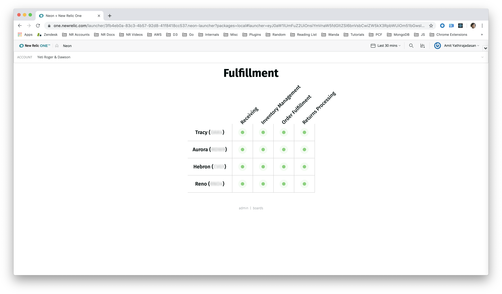
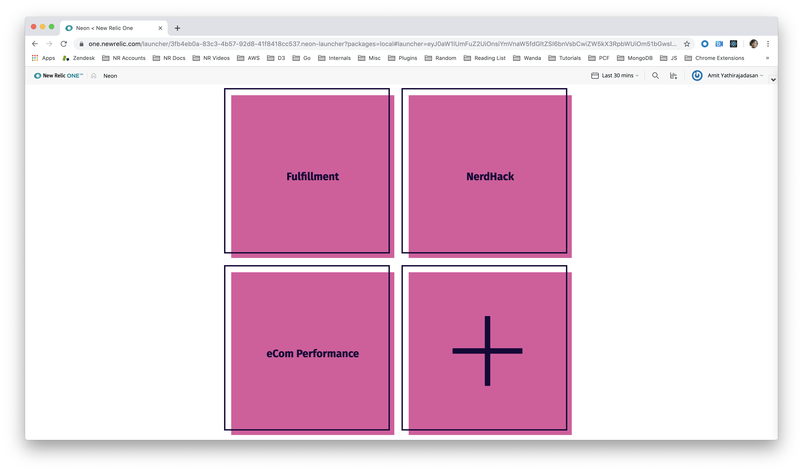

[](https://github.com/newrelic/open-source-office/blob/master/examples/categories/index.md#nr1-catalog)

# Neon

  [](https://snyk.io/test/github/newrelic/nr1-neon)

## Usage

Create a single dashboard to track the health of entire business units or regions. Neon lets you create a status board based on New Relic alert status, or the values from New Relic events.





## Open Source License

This project is distributed under the [Apache 2 license](./LICENSE).

## What do you need to make this work?

In order to view status of New Relic alerts, you'll need to set up a webhook notification channel for the alert policies.

See [Creat Alert Webhook Notification Channel](docs/alert_webhook_config.md)

## Getting started

First, ensure that you have [Git](https://git-scm.com/book/en/v2/Getting-Started-Installing-Git), [NPM](https://www.npmjs.com/get-npm) and the [New Relic One CLI](https://developer.newrelic.com/build-tools/new-relic-one-applications/cli) installed. If you're unsure whether you have these installed, run the following command(s). If you have them installed these commands will return a version number, if not, the commands won't be recognized.

```bash
git --version
npm -v
nr1 --version
```

Next, clone this repository and run the following scripts:

```bash
nr1 nerdpack:clone -r https://github.com/newrelic/nr1-neon.git
cd nr1-neon
nr1 nerdpack:uuid -gf
npm install
npm start
```

What you have just installed is a local version of neon.

To test the nerdpack, go to https://one.newrelic.com/?nerdpacks=local and click on the Neon icon to launch the application.


Close the Welcome screen and click the plus icon (+) to create your first board.


Click the HELP button for documentation on getting started.

To stop the application from running on your local machine, run control-C.

To re-run the application on your local machine, run

```bash
npm start
```

## Publish and Deploy this Nerdpack

Once you've modified and tested Neon to your requirements, you are ready to publish and deploy in in your New Relic account so others can have access to this application.

The instructions below assume that you have created a profile with an associated API key. If you haven't done this step, please review the publish and Deploy details found in [developer.newrelic.com](https://developer.newrelic.com/build-tools/new-relic-one-applications/publish-deploy)

Open a command prompt in the nerdpack's directory and run the following commands.

```bash
To create a new uuid for the nerdpack so that you can deploy it to your account:
nr1 nerdpack:uuid -gf [--profile=your_profile_name]

To see a list of APIkeys / profiles available in your development environment:
nr1 profiles:list

nr1 nerdpack:publish [--profile=your_profile_name]
nr1 nerdpack:deploy [-c [DEV|BETA|STABLE]] [--profile=your_profile_name]
nr1 nerdpack:subscribe [-c [DEV|BETA|STABLE]] [--profile=your_profile_name]
```

Visit [https://one.newrelic.com](https://one.newrelic.com), navigate to the Nerdpack, and :sparkles:

## Support

New Relic has open-sourced this project. This project is provided AS-IS WITHOUT WARRANTY OR SUPPORT, although you can report issues and contribute to the project here on GitHub.

_Please do not report issues with this software to New Relic Global Technical Support._

### Community

New Relic hosts and moderates an online forum where customers can interact with New Relic employees as well as other customers to get help and share best practices. Like all official New Relic open source projects, there's a related Community topic in the New Relic Explorers Hub. You can find this project's topic/threads here:

[https://discuss.newrelic.com/c/build-on-new-relic](https://discuss.newrelic.com/t/neon-alerting-nerdpack/83272)

### Issues / Enhancement Requests

Issues and enhancement requests can be submitted in the [Issues tab of this repository](../../issues). Please search for and review the existing open issues before submitting a new issue.

## Contributing

Contributions are welcome (and if you submit an Enhancement Request, expect to be invited to contribute it yourself :grin:). Please review our [Contributors Guide](./CONTRIBUTING.md).

Keep in mind that when you submit your pull request, you'll need to sign the CLA via the click-through using CLA-Assistant. If you'd like to execute our corporate CLA, or if you have any questions, please drop us an email at opensource+nr1-neon@newrelic.com.
