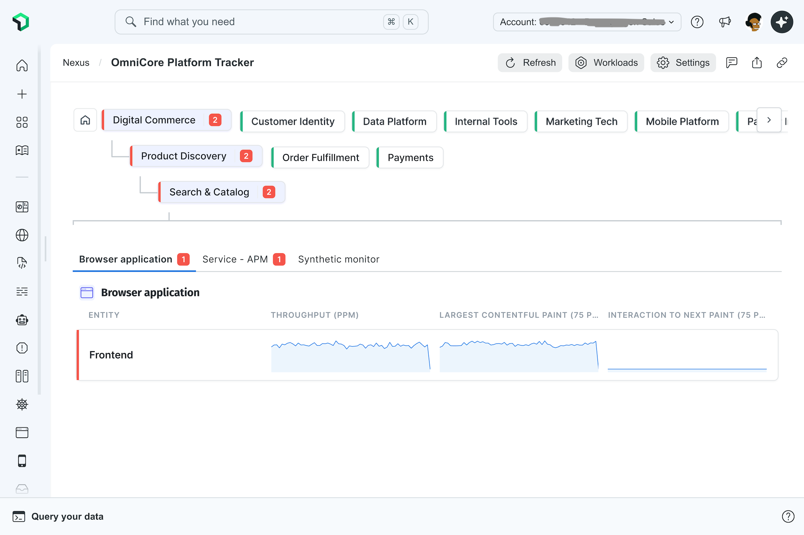

# Nexus (formerly Neon)

  

Nexus is an **executive dashboard** for New Relic that rolls up the health of your entire estate into a single view. Aggregate Workloads across teams, business units, or regions onto one board: leadership gets a single-glance health check, and engineering teams get rapid-fire triage into the issues underneath.

> ✨ Neon has been rebuilt and is now **Nexus**. If you're arriving from Neon, you're in the right place; the nerdpack repository name is unchanged.

## Usage

Nexus is driven by [New Relic Workloads](https://docs.newrelic.com/docs/new-relic-solutions/new-relic-one/core-concepts/workloads-isolate-resolve-incidents-faster/). Before you set up a board, make sure the Workloads you want to monitor already exist in your account.

To set up your dashboard:

1. Launch **Nexus** from the [New Relic Apps page](https://one.newrelic.com/catalog/app-directory).
2. Click the **Settings** button in the toolbar (on first launch, an empty-state prompt will point you at it directly).
3. In the Settings panel, filter or search the list of Workloads in your account and select the ones you want on the board.
4. (Optional) Toggle **Hide unacknowledged count** if you'd rather not surface unacknowledged issue counts on the board.
5. Click **Save**. Your selected Workloads appear on the board with their current alert severity and open-issue counts.

To add or remove Workloads later, reopen the Settings panel from the toolbar at any time.

## Dependencies

Nexus is driven by [New Relic Workloads](https://docs.newrelic.com/docs/new-relic-solutions/new-relic-one/core-concepts/workloads-isolate-resolve-incidents-faster/). You'll need at least one Workload defined in the account you want to monitor before setting up a board.

## Enabling this App

Nexus is available via the New Relic Catalog.

To enable it in your account:

1. Go to [`Integrations & Agents`](https://one.newrelic.com/marketplace), then click the `Apps & Visualizations` link at the top of the page and search for "Nexus"
2. Click the `Nexus` card, then click the `Add this App` button to add it to your account(s)
3. Click `Open App` to launch the app (note: on first access, you may be prompted to enable it)

Once you have added your accounts, you can also open the app by:

1. Opening the `Apps` left-hand navigation menu item (you may need to click on the `Add More` ellipsis if it doesn't show up by default)
2. In the `Your Apps` section, locating and clicking the `Nexus` card to open the app

#### Manual Deployment

If you need to customize the app, fork the codebase and follow the instructions on how to [Customize a Nerdpack](https://docs.newrelic.com/docs/new-relic-solutions/tutorials/customize-nerdpacks/). If you have a change you feel everyone can benefit from, please submit a PR!

## Support

Should you need assistance with Nexus, please leverage one of the following channels:

If you have a question about how to use the app, please review the [catalog documentation](catalog/documentation.md). If you are still unsure, feel free to open a question for us in the [Discussions forum](../../discussions).

If you have identified a bug, or if you have a feature request, please file a [Github issue](../../issues).

You can also reach out to [New Relic Technical Support](https://support.newrelic.com/) 24/7/365 ticketed support. Read more about our [Technical Support Offerings](https://docs.newrelic.com/docs/licenses/license-information/general-usage-licenses/support-plan).

We also encourage you to bring your experiences and questions to the [Explorers Hub](https://discuss.newrelic.com) where our community members collaborate on solutions and new ideas.

## Security

As noted in our [security policy](https://github.com/newrelic/nr1-neon/security/policy), New Relic is committed to the privacy and security of our customers and their data. We believe that providing coordinated disclosure by security researchers and engaging with the security community are important means to achieve our security goals.

If you believe you have found a security vulnerability in this project or any of New Relic's products or websites, we welcome and greatly appreciate [you reporting](https://docs.newrelic.com/docs/security/security-privacy/information-security/report-security-vulnerabilities/) it to New Relic.

## Contributing

Contributions are welcome (and if you submit an Enhancement Request, expect to be invited to contribute it yourself :grin:). Please review our [Contributors Guide](CONTRIBUTING.md).

Keep in mind that when you submit your pull request, you'll need to sign the CLA via the click-through using CLA-Assistant. If you'd like to execute our corporate CLA, or if you have any questions, please drop us an email at opensource+nr1-neon@newrelic.com.

## Open Source License

This project is distributed under the [Apache 2 license](./LICENSE).
