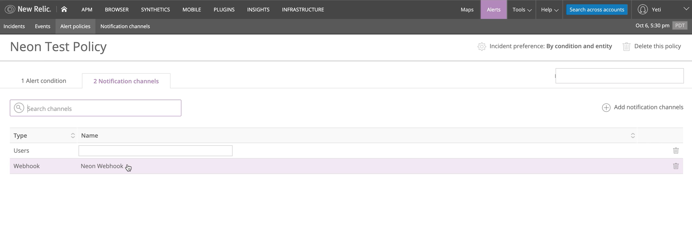

## Creating Your First Board  

In this example, we will create an Alerts board. You will need to set-up the alert policy to send notifications via a webhook notification channel as explained in this [blog](https://blog.newrelic.com/product-news/sending-alerts-data-to-insights/). Once you've set up the webhook notification channel, make sure you add it to the alert policy that will be visualized in Neon.   

