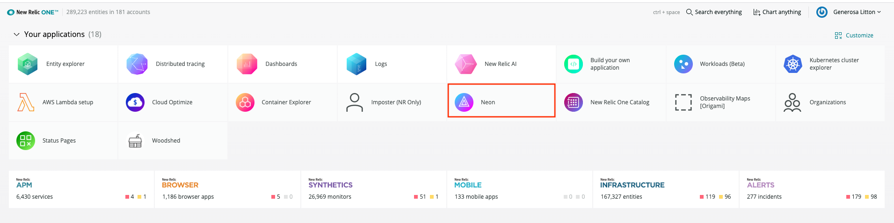
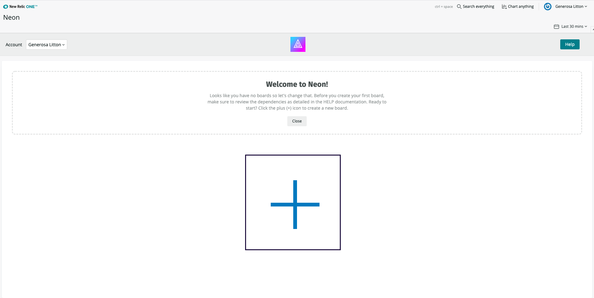

## Usage

Neon is an application that allows you to create a status at a glance visualization that can be scaled to track the health of entire business units or regions.

Statuses are derived from existing New Relic alert policies or based on values from New Relic events.

Neon makes it easy to configure the visualization to show exactly what you need to see.

## Open Source License

This project is distributed under the [Apache 2 license](https://github.com/newrelic/nr1-neon/blob/main/LICENSE).

## Dependencies

Requires [`New Relic Alerts`](https://newrelic.com/alerts) and a webhook notification configured as described [here](./docs/alert_webhook_config.md).

## Getting started

First, ensure that you have [Git](https://git-scm.com/book/en/v2/Getting-Started-Installing-Git) and [NPM](https://www.npmjs.com/get-npm) installed. If you're unsure whether you have one or both of them installed, run the following command(s) (If you have them installed these commands will return a version number, if not, the commands won't be recognized):

```bash
git --version
npm -v
```

Next, clone this repository and run the following scripts:

```bash
nr1 nerdpack:clone -r https://github.com/newrelic/nr1-neon.git
cd nr1-neon
nr1 nerdpack:serve
```

Visit [https://one.newrelic.com/?nerdpacks=local](https://one.newrelic.com/?nerdpacks=local), navigate to the Nerdpack, and :sparkles:

### Create A New Board

In your New Relic One account, click on the Neon icon 
in the Applications section.

Close the Welcome screen and click the plus icon (+) to create your first board.



In the modal window, type in your board title in the BOARD NAME text field.

Using the Event dropdown, select the New Relic event that you would like to display in your board. Events that appearin the dropdown are dependent on what you have in your account. For example, if you are using APM, you will see events such as Metric, Transaction, TransactionError, etc ...

Click the + Add button.

You will then see your new board in the Neon home page.

### Setup Board

To monitor the status of a **New Relic alert** make sure you've set up a 

Then perform the following steps:

1.  From the Neon home page, click on the board that you'd like to setup.
2.  You will see a row of options underneath your board title. Click on setup board.
3.  A modal window opens with a title of **Board Details**. Click on the Rows tab and type in a title in the **Title** text field.
4.  Click the + Add button. Your row title is now displayed on the board. Repeat the same step to add more row titles.
5.  Click on the column tab and type in your column name in the **Title** text field. Click on the + Add button. Repeat the same step to add more column titles.
6.  Click on the Cells tab, using the **SELECT A ROW** and **SELECT A COLUMN** dropdowns, select the Row and Column titles.
7.  Click on the **SELECT DATA TYPE** dropdown and select **New Relic Alert**. In the Alert Policy text field, enter the webhook policy name _exactly_ as you've named it in New Relic Alerts.
8.  Click the + Add button to finish the board setup.
9.  Click outside the modal or the X icon to close the modal.

To monitor the status of the **New Relic event** that you chose when you created a new board such as when an
attribute like average(duration) exceeded a certain value repeat steps 1 to 5 from the alert setup.

- For step 6 select New Relic Attribute
- In the Attribute Name text field, type in the attribute name like duration. Optionally you can prepend the attribute with an aggregator function such as average(duration).
- Click on the COMPARISON dropdown and select less than, equals, or greater than.
- In the Value text field, type in the value that you'd like Neon to monitor.
- For example, Neon can inform you when the average duration of a Page View event exceeds 1 second. Set up Neon using the average(duration) attribute name, with a COMPARISON of greater than, and a value of 1. When this event occurs, Neon will display that actual number that exceeded 1 in red.
- You may need to refresh the screen to see the changes take place.

### View Boards

While looking at an individual board, clicking on view boards will take you back to the Neon home page where all your boards are displayed.

### Edit Board

- To edit your row and/or column titles, go to the board that you'd like to edit and click on edit board.
- Click on the row or column tab and click on the edit button to edit the row or column title
- Type in the new row or column name and click the save button.
- To edit the cells and use the new row and/or column titles, click on cells tab then click the edit button. Use the row and/or column drop down to associate the new row and/or column title to the attribute or alert. You also have the option of changing the attributes.
- Click the cancel button to cancel editing.
- Click the delete button to delete the row or column title.
- Click the X icon in the upper right corner or anywhere outside the modal to exit edit mode.

### Delete Board

While viewing an individual board, click on delete board to completely get rid of a board.

## Deploying this Nerdpack

Open a command prompt in the nerdpack's directory and run the following commands.

```bash
# To create a new uuid for the nerdpack so that you can deploy it to your account:
# nr1 nerdpack:uuid -g [--profile=your_profile_name]

# To see a list of APIkeys / profiles available in your development environment:
# nr1 profiles:list

nr1 nerdpack:publish [--profile=your_profile_name]
nr1 nerdpack:deploy [-c [DEV|BETA|STABLE]] [--profile=your_profile_name]
nr1 nerdpack:subscribe [-c [DEV|BETA|STABLE]] [--profile=your_profile_name]
```

Visit [https://one.newrelic.com](https://one.newrelic.com), navigate to the Nerdpack, and :sparkles:

## Community Support

New Relic hosts and moderates an online forum where you can interact with New Relic employees as well as other customers to get help and share best practices. Like all New Relic open source community projects, there's a related topic in the New Relic Explorers Hub. You can find this project's topic/threads here:

[https://discuss.newrelic.com/t/neon-alerting-nerdpack/83272](https://discuss.newrelic.com/t/neon-alerting-nerdpack/83272)

Please do not report issues with Neon to New Relic Global Technical Support. Instead, visit the [`Explorers Hub`](https://discuss.newrelic.com/c/build-on-new-relic) for troubleshooting and best-practices.

## Issues / Enhancement Requests

Issues and enhancement requests can be submitted in the [Issues tab of this repository](https://github.com/newrelic/nr1-neon/issues). Please search for and review the existing open issues before submitting a new issue.

## Contributing

Contributions are welcome (and if you submit an Enhancement Request, expect to be invited to contribute it yourself :grin:). Please review our [Contributors Guide](https://github.com/newrelic/nr1-neon/blob/main/CONTRIBUTING.md).

Keep in mind that when you submit your pull request, you'll need to sign the CLA via the click-through using CLA-Assistant. If you'd like to execute our corporate CLA, or if you have any questions, please drop us an email at opensource+nr1-neon@newrelic.com.
