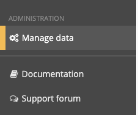
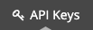
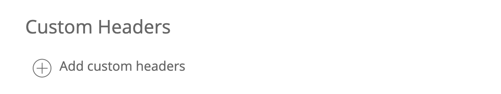

# Steps to create an alert webhook notification channel

In order to setup a webhook notification channel, you will need to do the following steps:

## 1. Generate an Insights insert token

Insights insert tokens can be generated from the _Manage data_ option in your New Relic Insights account (e.g. https://insights.newrelic.com/accounts/{your-account-id}/manage/summary



> Appears on the left hand navigation panel on the Insights landing page.



> Select the _Add data_ option from the top navigation menu.


> We will want to create a new _Insert Key_ click the "+" sign to enter the create dialog.


> You just need to enter a note to configure the key, I recommend Neon_Webhook (that will be the name of the Insights event table created)


> Once your key is created keep it handy, you will need it to configure the Webhook.

## 2. Create a Webhook notification channel

> In New Relic Alerts click on "Notification Channel" and then "New notification channel"


> Select the "Webhook" channel type


> Set the "Channel name" as NEON_ALERTS

> The "Base Url" should be the Insights collector events Url - be sure to specify your Account ID
> `https://insights-collector.newrelic.com/v1/accounts/{your account id}/events`

> You will need to add a custom header and specify the X-Insert-Key you generated in step 1 above




> Add a Custom Payload
> 

> Replace the default payload with the one below.

```
{
  "eventType": "NEON_ALERTS",
  "account_id": "$ACCOUNT_ID",
  "account_name": "$ACCOUNT_NAME",
  "closed_violations_count_critical": "$CLOSED_VIOLATIONS_COUNT_CRITICAL",
  "closed_violations_count_warning": "$CLOSED_VIOLATIONS_COUNT_WARNING",
  "condition_family_id": "$CONDITION_FAMILY_ID",
  "condition_name": "$CONDITION_NAME",
  "current_state": "$EVENT_STATE",
  "details": "$EVENT_DETAILS",
  "duration": "$DURATION",
  "event_type": "$EVENT_TYPE",
  "incident_acknowledge_url": "$INCIDENT_ACKNOWLEDGE_URL",
  "incident_id": "$INCIDENT_ID",
  "incident_url": "$INCIDENT_URL",
  "metadata": "$METADATA",
  "open_violations_count_critical": "$OPEN_VIOLATIONS_COUNT_CRITICAL",
  "open_violations_count_warning": "$OPEN_VIOLATIONS_COUNT_WARNING",
  "owner": "$EVENT_OWNER",
  "policy_name": "$POLICY_NAME",
  "policy_url": "$POLICY_URL",
  "runbook_url": "$RUNBOOK_URL",
  "severity": "$SEVERITY",
  "targets": "$TARGETS",
  "timestamp": "$TIMESTAMP",
  "violation_callback_url": "$VIOLATION_CALLBACK_URL",
  "violation_chart_url": "$VIOLATION_CHART_URL"
}
```

> Save your changes


> You should have defined a notification channel that looks like the following


## 3. Create an Alert and add the NEON_ALERTS notification Webhook

In New Relic alerts, create an alert policy and condition that you'd like to visualize in Neon. Make sure to use the NEON_ALERTS webhook notification channel.

> For example, PawsFinder Page Performance is the name of the alert policy that tracks a browser page rendering time. Add a webhook notification channel called NEON_ALERTS to this alert policy.


> Take note of the name and syntax of the alert policy as you will be using this in step 6 of Neon's Setup Board step.

> Note: An Alert has to have fired to be visible in Neon.
